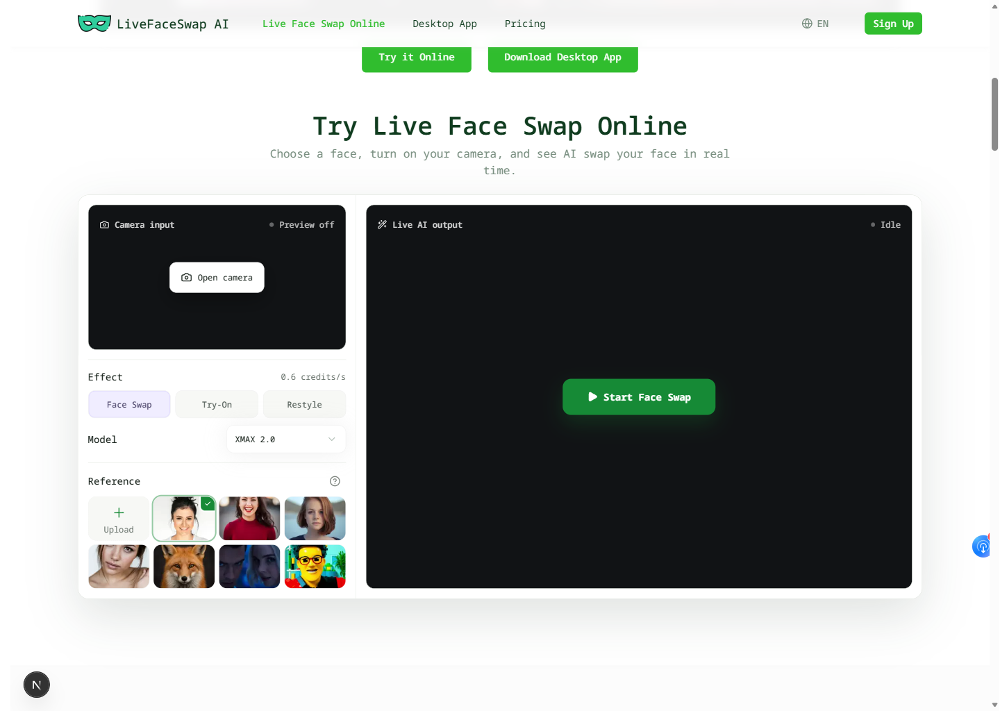
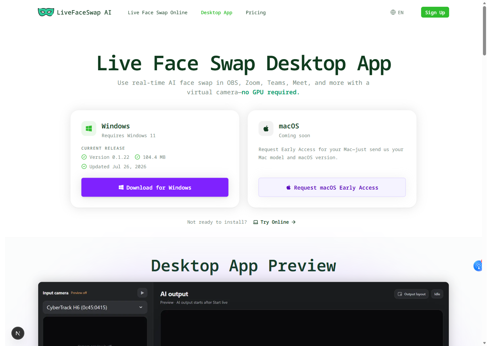

  

# LiveFaceSwap AI

[English](README.md) | [简体中文](README.zh-CN.md)

Official public product repository for [LiveFaceSwap AI real-time face swap](https://livefaceswap.ai). Test an authorized portrait, outfit, or style reference with a webcam in the browser, then use LiveFaceSwap Desktop when you need Windows 11 virtual-camera output.

This repository is the canonical place for public product feedback, workflow questions, roadmap notes, support guidance, and security reporting. It does not publish the private production source code for the website or desktop application.

## Product Preview

## What You Can Do

- Preview a real-time AI transformation in a browser without installing the desktop app.
- Choose Face Swap, Try-On, or Restyle with an appropriate authorized reference.
- Compare camera input and live AI output before continuing with a longer session.
- See the selected model and metered credit rate before a live session starts.
- Install [LiveFaceSwap Desktop for Windows 11](https://livefaceswap.ai/desktop) and expose processed output as **LiveFaceSwap Camera** in compatible software.
- Use cloud processing without downloading a separate local AI model or requiring a dedicated GPU; a stable internet connection is required.

## Browser And Desktop Workflows

| Workflow | Best for | Current boundary |
| --- | --- | --- |
| Browser preview | Testing Face Swap, Try-On, or Restyle from a webcam | Preview only; it does not create a cross-app camera device |
| LiveFaceSwap Desktop | Sending transformed output into compatible streaming, meeting, or video-call software | Public download targets Windows 11 x64, build 22000 or newer |
| macOS Early Access | Registering interest in a future Mac workflow | Request-only; there is no public macOS installer |

Only use images and live transformations with the subject's permission. Test privately before broadcasting, disclose synthetic media where context calls for it, and do not use the product for impersonation, fraud, harassment, or deception.

## Recent Updates

- 2026-07: Added the Windows 11 Desktop download path and LiveFaceSwap Camera virtual-camera workflow.
- 2026-07: Clarified the browser preview boundary, visible metered rate, cloud-processing requirement, and macOS Early Access status.
- 2026-07: Opened this public repository for product feedback, roadmap discussion, support, and security routing.

## What To Open Here

- Reproducible browser-preview problems involving camera input, references, effect selection, model selection, or session start.
- Desktop setup or LiveFaceSwap Camera routing problems that can be discussed without private data.
- Documentation, accessibility, safety, pricing-clarity, or workflow feedback.
- Roadmap ideas that would improve the public product experience.

Before filing an issue, remove faces, account details, payment information, access tokens, and sensitive logs. Use [private support](SUPPORT.md) for account-specific help and follow [the security policy](SECURITY.md) for vulnerabilities.

## Repository Boundary

- Public product documentation and feedback belong here.
- Private production source, provider configuration, billing configuration, deployment secrets, customer data, and uploaded personal media are not published here.
- This repository is not a downloadable copy of the production service or desktop application.
- Contributions should focus on documentation, reproducible product feedback, and community guidance unless a maintainer explicitly opens another contribution area.

## Project Links

| Destination | Link |
| --- | --- |
| Official product | [LiveFaceSwap AI real-time face swap](https://livefaceswap.ai) |
| Desktop workflow | [LiveFaceSwap Desktop virtual camera for Windows 11](https://livefaceswap.ai/desktop) |
| Canonical repository | [LiveFaceSwap AI public product repository](https://github.com/LiveFaceSwapAI/livefaceswap) |
| Public feedback | [LiveFaceSwap AI GitHub Issues](https://github.com/LiveFaceSwapAI/livefaceswap/issues) |
| Roadmap | [LiveFaceSwap AI public roadmap](ROADMAP.md) |
| Support | [LiveFaceSwap AI support guide](SUPPORT.md) |
| Security | [LiveFaceSwap AI security policy](SECURITY.md) |

## Official Mirrors

GitHub is the canonical public repository. The following verified mirrors provide
platform-specific discovery and feedback routes for the same public-safe product
documentation; production website and desktop source code remain private.

| Platform | Official mirror |
| --- | --- |
| GitLab | [livefaceswapai1/livefaceswap](https://gitlab.com/livefaceswapai1/livefaceswap) |
| Bitbucket | [livefaceswapai/livefaceswap](https://bitbucket.org/livefaceswapai/livefaceswap) |
| Tangled | [livefaceswapai.tngl.sh/livefaceswap](https://tangled.org/livefaceswapai.tngl.sh/livefaceswap) |
| GitCode | [weixin_52314137/livefaceswap](https://gitcode.com/weixin_52314137/livefaceswap) |
| Gitee | [yhc2073/livefaceswap](https://gitee.com/yhc2073/livefaceswap) |
| Gitea | [livefaceswap-official/livefaceswap](https://gitea.com/livefaceswap-official/livefaceswap) |
| Codeberg | [livefaceswapai/livefaceswap](https://codeberg.org/livefaceswapai/livefaceswap) |
| Disroot Git | [livefaceswapai/livefaceswap](https://git.disroot.org/livefaceswapai/livefaceswap) |
| Launchpad | [~livefaceswapai/+git/livefaceswap](https://code.launchpad.net/~livefaceswapai/+git/livefaceswap) |
| repo.or.cz | [livefaceswap.git](https://repo.or.cz/livefaceswap.git) |
| SourceForge | [livefaceswap/code](https://sourceforge.net/p/livefaceswap/code/) |

## Language Authority

The English README is authoritative for current product boundaries. The [complete Simplified Chinese README](README.zh-CN.md) is maintained for Chinese readers; if wording differs, follow the English version or contact support.
